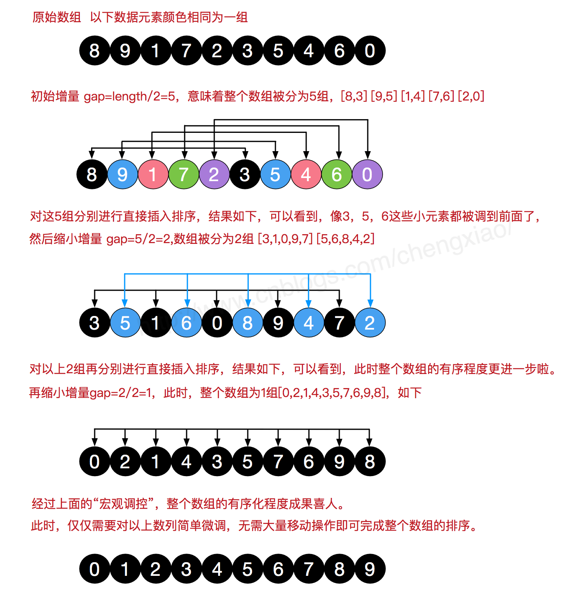

# Week-05总结

## 知识点总结

### 三分查找

1. 使用场景
    - 求单峰函数的极大值或是单谷函数的极小值（二分用于在单调函数上寻找特定值）
    - 也可用于求函数的局部极大/极小值
    - 限制条件：函数是分段严格单调递增/递减的，不能出现一段平的情况

2. 求单峰函数f的极大值，在定义域[l,r]上任意取两点lmid，rmid
    - 若f(lmid)<=f(rmid)，函数必然在lmid处单调递增，极值在[lmid,r]
    - 若f(lmid)>f(rmid)，函数必然在rmid处单调递减，极值在[l,rmid]
   
3. lmid和rmid的取值策略
   - lmid和rmid可以取三等分点
   - lmid可以取二等分点，rmid为lmid稍微加一点偏移量，使之接近二分查找
   
### 二分答案
1. 基本思想
   - 将一个求最优解的过程，转换为判定一个解是否合法
   - 找到判定算法，枚举解空间，逐一判定，合法的就是正解
   - 当解空间具有单调性时，可以使用二分替代枚举，结合判定快速求出最优解
   
2. 二分答案的使用场景
   - 通常用于最优化问题求解，尤其出现"最大值最小"，"最小值最大"这类字眼
   - "最大值最小"中的"最小"是一个最优化目标，"最大"一般是限制条件
   - 判定问题的条件通常是一个不等式，反应上述的限制条件，当合法解具有特殊单调性时就可以使用二分答案
   
3. 本质
   - 建立一个单调的分段0/1函数，定义域为解空间，值域为0或1，在这个函数上二分查找分界点

### 排序算法
#### 分类
1. 基于比较的排序
   - 通过比较大小来决定元素的相对次序，时间复杂度最优为O(logn)
   - 算法
      - 交换排序：冒泡排序，快速排序
      - 插入排序：简单插入排序，希尔排序
      - 选择排序：简单选择排序，堆排序
      - 归并排序：二路归并排序，多路归并排序
2. 非比较类的排序
   - 不通过比较大小来决定元素的相对次序，时间复杂度不单纯取决于n，受元素的范围及分布等多种因素影响
   - 算法
      - 计数排序
      - 桶排序
      - 基数排序
   
#### 初级排序算法 - 选、插、冒，平均时间复杂度O(n^2)
1. 选择排序
   - 该放哪个数了
   - 每次从未排序的数据中找到最小值，放到已经排序序列的末尾
   
2. 插入排序
   - 这个数该放哪
   - 从前往后依次考虑每个未排序的数，在已经排好序的序列中找到合适的位置插入
   
3. 冒泡排序
   - 不断循环扫描，每次查看相邻的元素，如果逆序，则交换

#### 堆排序
   - 对选择排序的优化
   - 利用二叉堆小根堆的性质，依次从堆中取出堆顶元素
   - 时间复杂度O(logn)

#### 希尔排序
   - 对插入排序的优化
   - 增量分组插入排序
   - 时间复杂度取决于增量序列，已知最好的序列可做到O(n^4/3)或O(nlog^2n)
   - 图示
   

#### 归并排序
   - 基于分治的算法，把数组分成前后各一半分别进行排序，然后再合并左右已经排序好的数组
   - 先排序左右两个数组，然后再合并两个有序数组
   - 时间复杂度O(nlogn)，其中logn为二叉树的高度
   - 缺点：合并排序时需要临时数组
   - 代码模板
   ```
   public static void mergeSort(int[] arr, int l, int r){
      if(l >= r){
         return;
      }
      int mid= (l + r) / 2;
      //排序左半段
      mergeSort(arr, l, mid);
      //排序右半段
      mergeSort(arr, mid + 1, r);
      //左右两段都排序完后，合并
      merge(arr, l, mid, r);
   }
   
   //合并[left, right]区间内左右两段的数组
   private void merge(int[] arr, int left, int mid, int right){
      //定义临时数组
      int[] temp = new int[right - left + 1];
      //左半段数组在原数组中的开始下标
      int i = left；
      //右半段数组在原数组中的开始下标
      int j = mid + 1;
      //合并两个有序数组
      //参考之前的合并两个有序数组算法，取值小的放入temp，然后索引++，值大的索引不动
      for(int k = 0; k < temp.length; k++){
         //将左半段元素放入临时数组的条件
         //如果右半段数组遍历结束，或左、右半段数组没遍历完且左半段元素值<=右半段数组元素的值
         if(j > right || (i <= mid && arr[i] <= arr[j])){
            //将数值小的放入temp，下标++
            temp[k] = arr[i++];
         }else{
            //将数值小的放入temp，下标++
            temp[k] = arr[j++];
         }
         
         //将合并好的排序数组更新会原数组
         for(int k = 0; k < temp.length; k++){
            arr[left + k] = temp[k];
         }
      }
   }

   ```
   
#### 快速排序
   - 基于分治的算法
   - 向调配出左右子数组，左边都是<=某个数的序列，右边都是>=某个数的序列，然后对左右子数组分别进行排序 
   - 快速排序的步骤
      - 在数组中随机选取中轴元素pivot
      - 将小的元素放在pivot的左边，大的元素放在pivot的右边
      - 然后分别对左边和右边的子数组进行快排
   - 期望时间复杂度O(nlogn)
   - 可以通过适当的交换来实现数组调配，避免占用额外的空间
      - 最经典和高效的调配方式：[Hoare Partition](https://www.bilibili.com/video/BV1q64y1S7Ax)
   - 代码模板
   ```
   public static void quickSort(int[] arr, int l, int r){
      //终止条件
      if(l == r){
         return;
      }
      //选择中轴元素pivot
      int pivot = partition(arr, l, r);
      quickSort(arr, l, pivot);
      quickSort(arr, pivot + 1, r)
   }
   
   private int partition(int[] arr, int l, int r){
      //基于原数组，[l, r]数组下标中随机选择一个中轴元素
      int pivot = l + (int)（Math.random() * (r - l + 1));
      int pivotVal = a[pivot];
      
      while(l <= r){
         //如果中轴元素左边的值小于中轴元素，元素不动，下标向右移动
         while(arr[l] < pivotVal){
            l++;
         }
         
         //如果中轴元素右边的值大于中轴元素，元素不动，下标向左移动
         while(arr[r] > pivotVal){
            r--;
         }
         
         //剩下的值都不满足"右边的值大于中轴元素，左边的值小于中轴元素"，交换l和r对应的值
         if(l <= r){
            int temp = a[l];
            a[l] = a[r];
            a[r] = temp;
            //移动下标
            l++;
            r--;
         }
      }
      
      //返回right的位置
      return r;
   }

   ```

## 算法思路总结

### 二分答案
   - 先找到解空间，使用二分思想枚举解空间
   - 再设计判定算法验证解是否合法，通常循环序列，基于贪心计算，然后判断计算值是否<=某个阈值