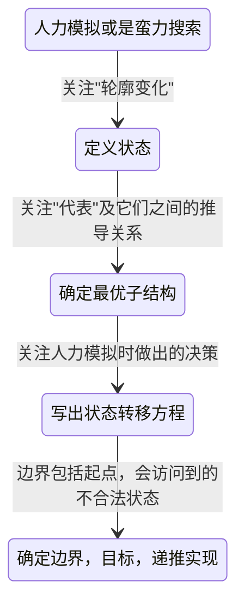
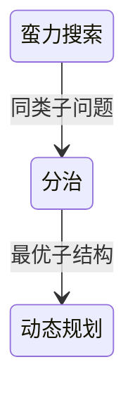

# Week-06总结

## 知识点总结

### 动态规划 - Dynamic Programming
1. 概念
    - 一种对问题的状态空间进行分阶段，有顺序，不重复，决策性遍历的算法
    - 一般采用递推的方式实现，也可以采用递归或搜索的形式
    - 每个状态只遍历一次，也被称为记忆化搜索
    
2. 关键与前提
    - 重叠子问题，与递归、分治等一样，要具有同类子问题，用若干维状态表示
    - 最优子结构，状态对应着一个最优化目标，并且最优化目标之间具有推导关系
         - 假设可以从状态2到状态1
         - 状态2的最优化目标 = 状态1的最优化目标 + 状态2到状态1的最优化目标
         - 也就是说状态2的最优化目标可以由状态1的最优化目标推导出来
         - 整个状态空间存在一个最优子结构，该最优子结构是由一个状态一个状态的最优化目标累加推导出来的
    - 无后效性，问题的状态空间是一张有向无环图，即可以按照一定的顺序遍历求解

3. 三要素
    - 阶段，线性增长，一般是遍历所有的情况
    - 状态，具有最优子结构
    - 决策，找到重叠子问题

4. DP代码模板总结
    - 若干循环，遍历所有的状态
    - 在若干循环里遍历所有的决策
    - 将递推的式子写出

5. 动态规划与贪心对比
    - 能够用贪心解决的问题，都能用动态规划解决，只是时间复杂度可能会差一些
    - 针对问题，不要从贪心开始想
    
6. 状态与决策的平衡选择
    - 状态包含的信息越多，决策越简单
    - 状态越简单，决策越复杂
    - 尽量把人工模拟时关注的信息都放到状态里，除非最后状态规模太大，再考虑优化
    
7. 状态转移方程的两种写法
    - f[i][j][k][l]该怎么计算，"谁能走到我"
    - f[i][j][k][l]能更新哪个状态，"我能走到谁"
    - 在思考问题时，可以从这个两个角度去考虑，选择简单顺手的方式处理
    - 可以使用列表法，列举状态转移方程
    
        | 当前状态 | 下一天干啥？ | 条件？ | 代价/收益？ | 完成之后的状态？ |
        | ---- | ---- | ---- | ---- | ---- |
        | xxxx | xxxx | xxxx | xxxx | xxxx |
    
8. 空间的优化
    - 如果状态转移只在相邻的两行之间发生，可以使用滚动数组优化
    - 实现中，先不优化，写完后在每个f的第一维加&1 
    

## 算法思路总结

### 理解零钱兑换
   - 目标是让amount==0，找到使用最少的硬币的数量
   1. 搜索的思路
      - 列举问题的状态空间
      - 在列举状态空间时，只关心动态变量-当前amount和已经使用的硬币数
      - 枚举所有的状态空间之后，找到amount==0，且使用硬币数量最少的状态
   2. DP的思路
      - 在使用DP方法分析时，某一个状态A的最优化目标可以由状态A之前状态的最优化目标推导出来
      - 把当前amount做为状态，使用的硬币数量做为最优化的目标
      - 问题可以转化为，当amount==n时求使用的最少的硬币数量
      - 根据最优化子结构递推，最小硬币数(n) = min(最小硬币数(n-1),最小硬币数(n-9),最小硬币数(n-10)) + 1

### 动态规划解题步骤
1. 人力模拟或是蛮力搜索
2. 定义状态
3. 确定最优子结构
4. 写出状态转移方程
5. 确定边界和目标，采用递推实现

### 动态规划打印方案
   - 原则：记录转移路径+递归输出
   - 动态规划选取"代表"，维护了一个最优子结构，如果维护每个最优子结构的详细方案，时间复杂度会上升

### 自然的解题路线
