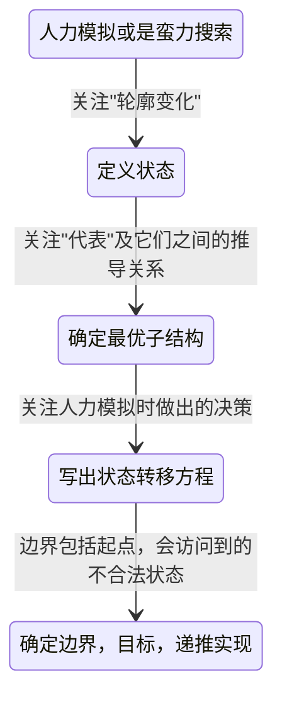

# Week-06总结

## 知识点总结

### 动态规划 - Dynamic Programming
1. 概念
    - 一种对问题的状态空间进行分阶段，有顺序，不重复，决策性遍历的算法
    - 一般采用递推的方式实现，也可以采用递归或搜索的形式
    - 每个状态只遍历一次，也被称为记忆化搜索
    
2. 关键与前提
    - 重叠子问题，与递归、分治等一样，要具有同类子问题，用若干维状态表示
    - 最优子结构，状态对应着一个最优化目标，并且最优化目标之间具有推导关系
    - 无后效性，问题的状态空间是一张有向无环图，即可以按照一定的顺序遍历求解

3. 三要素
    - 阶段，线性增长，一般是遍历所有的情况
    - 状态，具有最优子结构
    - 决策，找到重叠子问题

## 算法思路总结

### 动态规划解题步骤
1. 人力模拟或是蛮力搜索
2. 定义状态
3. 确定最优子结构
4. 写出状态转移方程
5. 确定边界和目标，采用递推实现

### 动态规划打印方案
   - 原则：记录转移路径+递归输出
   - 动态规划选取"代表"，维护了一个最优子结构，如果维护每个最优子结构的详细方案，时间复杂度会上升