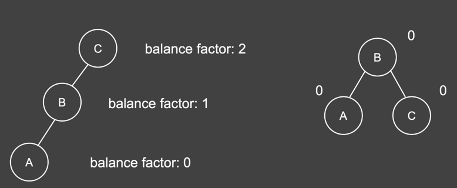
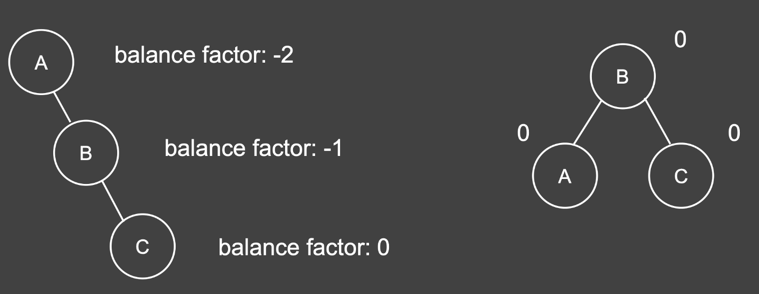
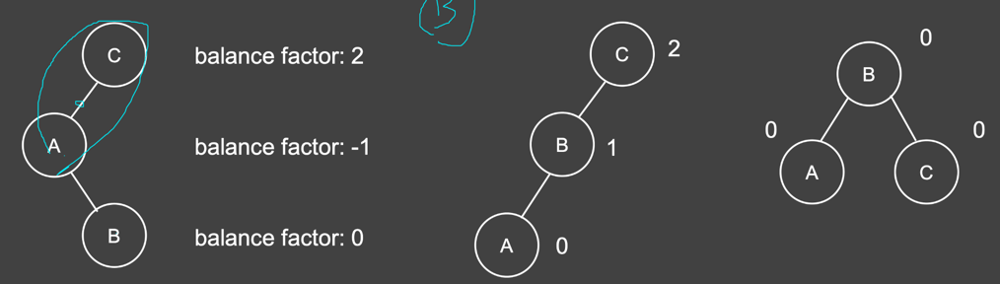
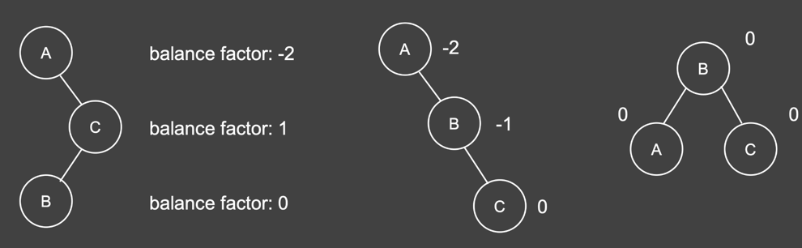
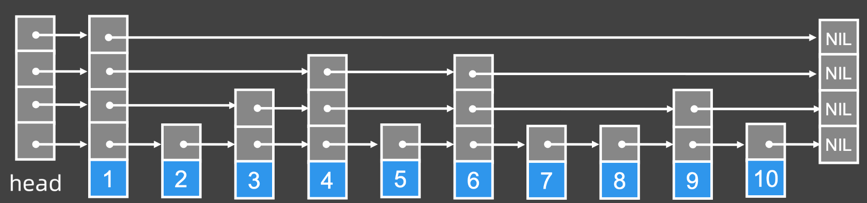

# Week-09总结

## 知识点总结

### 高级搜索

#### 初级搜索复习

1. 蛮力搜索的三种基本类型

    | 递归形式 | 时间复杂度模型 | 问题举例
    |---|---|---
    | 指数型  | k^n  |  子集、大体积背包 
    | 排列型 | n!  | 全排列、旅行商、N皇后 
    | 组合型  | Cnm  | 组合选数  

2. 初级搜索的简单优化（BFS，DFS）
    - 判重，避免重复搜索某一状态
        - 如通过是否已被访问数组visited标记走个状态是否被访问过
    - 剪枝
        - 通过已有的信息，提前判定某些分支不可行或一定不优 
        - 从而不去访问这些状态，减少需要访问的状态数量
    
#### 高级搜索
1. 双向搜索 - BFS
    - 从初态和终态出发个搜索一半状态，产生两棵深度减半的搜索树
    - 在交会时，合并成最终的答案
    - 适用于宽度较宽但深度不深的树
    - 处理步骤
        - 一般先写普通的BFS
        - 重用普通BFS方法，设置两个方向的队列，并分别设置起始元素
        - 每次每个队列处理一**层**，交替进行，直到相遇
    
2. 迭代加深 - DFS
    - 防止开始选错分支，在不包含答案的深层子树上浪费时间
    - 适用于深度很大但答案可能不太深的问题
    - 处理思路
        - 设置迭代变量
        - 当前深度没有找到结果，迭代变量+1，继续搜索
        - 重复上一步直到找到答案返回
    
3. 折半搜索
    - 适用于集合类的问题，将集合分成两部分，分别搜出结果后再合并
    - 类似于双向BFS
    - 举例：大体积背包问题
        - N个物品，选出一些尽量填满体积为M的背包，时间复杂度O(n^2)
        - 如果M很大，可以把集合分成两组，每组搜出所有可能的和
        - 枚举其中一组的和sum
        - 另一组提前排序，二分查找M-sum的前驱
        - 优化后时间复杂度O(n*2^(n/2))

4. 启发式搜索 - A*算法
    - 估价函数：A*算法的关键
        - 以任意"状态"输入，计算出由该状态到目标状态所需代价的估计值
        - 维护一个优先队列，优先选择"当前代价+未来估价"最小的状态扩展
        - 设计原则：估计代价<=未来实际代价，估值比实际更优
        - 乐观估计，估价越精准，A*算法越快
    - 与优先队列BFS对比
        - 考虑优先级时是否加上未来估价
        - 估价等于0，退化为优先队列BFS

### 平衡二叉树
#### AVL树
1. 回顾BST
    - 任意节点的key>=该节点左子树所有节点的key
    - 任意节点的key<=该节点右子树所有节点的key
    - 中序遍历（左根右）为一个有序序列
    - 插入、查询、删除、求前驱、求后继时间复杂度
        - 随机数据期望O(logn)
        - 非随机数据上，容易退化为O(n)
    - 保证性能的关键：左右子树节点数平衡

2. 树的旋转
    - 左旋和右旋
    - LL左左子树：右旋
      
      
    - RR右右子树：左旋
      
      
    - LR左右子树：先左旋，再右旋
      
      
    - RL右左子树：先右旋，再左旋
      
      

3. 自平衡二叉树：AVL - Adelson-Velsky and Landis Tree
    - 任意节点的平衡因子的绝对值不超过1{-1, 0, 1}
        - 平衡因子：一个节点左子树的高度-它右子树的高度
    - 每个节点要保存：原始数据、左子节点，右子节点、子树高度
    - AVL树的插入和删除
        - 沿途更新节点高度值
        - 当平衡因子绝对值大于1时，通过旋转进行平衡

#### 红黑树 - Red-black Tree
1. 基本概念
    - 一种近似平衡得到二叉树
    - 规则打破时，通过变色或旋转来修正
    - 许多语言中有序集合的内部实现，如Java中的TreeSet, TreeMap
      
2. 红黑树规则
    - 节点中有红黑两种颜色
    - 根节点是黑色
    - 最底层视作一层黑色空叶节点
    - 不能有两个相邻的红色节点
    - 从任意节点到它的每个叶子节点的所有路径都包含相同树木的黑色节点
    
3. 对比AVL
    - 插入快，旋转少
    - 省空间，不用存储平衡因子，通过颜色来判断是否平衡
    - 查询稍慢，不如AVL更加平衡

### 跳表 
1. 基本概念
    - Skip List
    - 是对元素有序**链表**的优化
        - 通过随机建立多级索引
        - 利用随机+概率，当元素足够多时，期望随机出来的索引分布比较均匀
    - 核心思想：提高链表的查询效率
        - 链表插入、删除时间复杂度O(logn)
        - 链表查询时间复杂度O(n)
    - 查询、插入、删除时间复杂度都是O(logn)
    - 空间复杂度O(n)
        - 索引层数O(logn)的
        - 跳表的节点总数约是2n(n个原始节点，n个索引节点)
    - 现实中链表的形态
    
2. 对比二分查找和平衡树
    - 二分查找
        - 在数组上实现O(logn)的查询
        - 不能用于链表
    - 平衡树
        - 支持高效的查询、删除、插入操作
        - 实现复杂
    - 跳表
        - 查询、删除、插入操作时间复杂度O(logn)
        - 原理简单，容易实现，扩展方便，效率优秀
        - 应用在Redis，LevelDB等用于取代平衡树
    
### 树堆 - Treap：Tree + Heap
- 树堆的每个节点保存两个值
    - 原始数据：key
    - 额外的权值：随机生成
- 特性 
    - 树堆首先是一棵二叉搜索树，节点关键码满足BST的性质，左<=根<=右
    - 树堆还是一个堆，节点的额外权值满足大根堆性质，父>=子
    - 各项时间复杂度O(logn)
    - 检索、求前驱、求后继的操作与BST的操作一致
    - 插入、删除节点之后不需要想BST那样调整来满足大根堆的特性，直接通过旋转来满足
    
